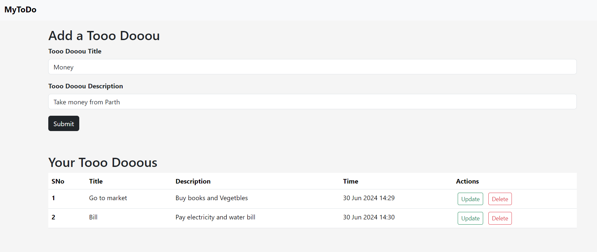
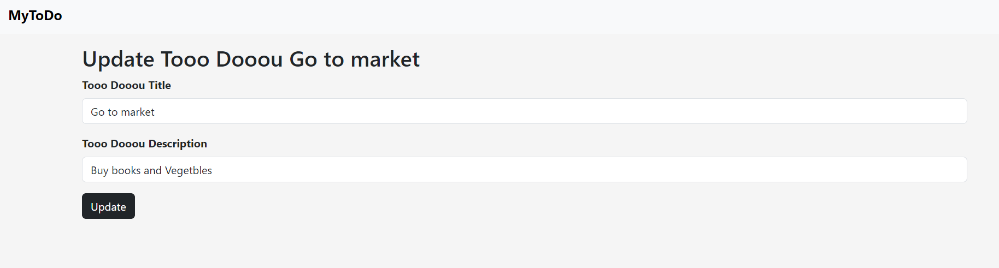

# Tooo Dooou

A simple to-do app to create, update, and delete to-dos.

## Tech Stack
- HTML
- CSS
- JavaScript
- Python
- Flask
- Jinja2

## Features
- Create new to-do items
- Update existing to-do items
- Delete to-do items

## Getting Started

### Prerequisites
- Python 3.x

### Installation
1. Clone the repository:
    
2. Navigate to the project directory:
    ```bash
    cd tooo-dooou
    ```
3. Install the required packages:
    ```bash
    pip install -r requirements.txt
    ```

### Running the App
1. Run the application:
    ```bash
    python .\app.py
    ```
2. Open your browser and go to `http://127.0.0.1:5000`.

## Usage
This is a basic "To Do" app I made while learning Flask.

## Screenshot


